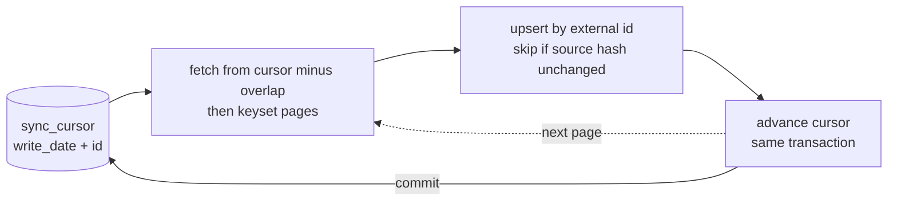

# erp-incremental-sync

Incremental, idempotent ERP-to-database sync with dry-run mode, cursoring and safe re-runs, demonstrated against a mock Odoo-style JSON-RPC server.

## Problem

Pulling "everything" from an ERP on every run is slow, hammers the API, and makes re-runs risky. Pulling "what changed" is only safe if three things hold: a re-run never double-writes, a crash never skips rows, and you can preview what a run would do first. This repo shows one way to get all three with nothing but Node and SQLite.

## How it works



## Tech

Node 24, built-in `node:sqlite`, built-in `fetch` and `node:test`. No runtime dependencies, no Docker. The ERP is a small mock (`mock-erp/server.mjs`) speaking the `/jsonrpc` shape (`common.authenticate`, `object.execute_kw` with `search_read`) over seeded synthetic `helpdesk.ticket` and `mail.message` data.

## Quick start

```bash
git clone https://github.com/abdalrahmnamo-svg/erp-incremental-sync.git
cd erp-incremental-sync
npm ci
npm run mock-erp                 # terminal 1: mock ERP on http://localhost:8069
npm run sync -- --dry-run        # terminal 2: plan only, writes nothing
npm run sync                     # first real sync
npm run sync                     # again: re-reads the overlap window, 0 writes
npm run mock-erp:mutate          # edit 2 tickets, create 1 ticket + 1 message in the mock ERP
npm run sync                     # picks up only those 4 rows
npm run sync -- --since 2026-01-01   # ignore the cursor, re-read from a date
```

Defaults match `.env.example`, so no `.env` is needed for the demo. The target database is `output/sync.db` (override with `SYNC_DB_PATH`). Run `npm test` for the test suite (the mock ERP is started in-process on a random port).

### Example: dry run on an empty target

```
ERP sync (DRY RUN: nothing will be written)
Connected as uid 1 (http://localhost:8069, db demo); target (read-only) output\sync.db
Start: stored cursor minus overlap | page size 50 | overlap 2s

helpdesk.ticket
  cursor  (none)  ->  2026-02-01 09:00:00 #60  (not saved)
  pages 2 | fetched 60 | would insert 60 | would update 0 | unchanged 0 | skipped 0
mail.message
  cursor  (none)  ->  2026-02-01 09:00:00 #190  (not saved)
  pages 4 | fetched 190 | would insert 190 | would update 0 | unchanged 0 | skipped 0
Plan: 250 row(s) would change.
Re-run without --dry-run to apply.
```

Re-running right after the first sync re-reads only the overlap window and writes nothing:

```
helpdesk.ticket
  cursor  2026-02-01 09:00:00 #60  ->  2026-02-01 09:00:00 #60
  pages 1 | fetched 6 | insert 0 | update 0 | unchanged 6 | skipped 0
mail.message
  pages 1 | fetched 15 | insert 0 | update 0 | unchanged 15 | skipped 0
Nothing to do: target is up to date.
```

After `npm run mock-erp:mutate`, the next sync reports `insert 1 | update 2` for tickets and `insert 1` for messages; everything else it re-read is `unchanged`.

## Duplicate cleanup: plan, review, apply, rollback

The mock ERP deliberately contains three tickets that exist twice under different ids (same customer, subject and creation time). Cleaning that up is a reviewed, reversible workflow:

```bash
npm run dupes:plan                          # read-only; writes output/dupes-plan-<id>.json
# review the JSON: which ticket is kept, which messages move or are dropped
npm run dupes:apply -- output/dupes-plan-<id>.json --dry-run   # rehearse, then roll back
npm run dupes:apply -- output/dupes-plan-<id>.json             # apply, one transaction per group
npm run dupes:rollback -- output/dupes-plan-<id>.json          # restore the exact original rows
```

- The kept copy is the one with the most messages (ties: lowest id). Messages the keeper lacks are moved onto it; messages it already has are dropped with the removed ticket.
- Apply refuses any group whose rows changed since the plan was made (fingerprint check).
- Everything removed is stored in `dupe_backup`; rollback restores it byte for byte. The tests compare full table dumps before apply and after rollback.
- Removed ids go into `sync_suppress`, so a later sync (even `--since`) does not bring the duplicates back.

## Engineering notes

- **Idempotency.** Every row is keyed by the ERP's own id and written with an upsert. Each source record is hashed; if the hash matches the stored one the row is left alone, so re-delivery costs a SELECT and no writes. "Re-sync is a no-op" means zero writes (rows may be fetched, all classified `unchanged`); the test asserts SQLite's `total_changes()` does not move on a re-run.
- **Why an overlap window.** A strict "after the cursor" start can silently miss (1) a record with a lower id edited in the same second as the cursor, and (2) rows that commit late with a `write_date` slightly in the past (clock skew, long transactions). So each run starts from `write_date >= cursor.write_date - SYNC_OVERLAP_SECONDS` (default 2, set in `.env`), then pages by keyset within the run. The re-read rows are cheap because unchanged rows cost no writes. The cursor still never moves backwards and still advances in the same transaction as its page. Remaining limit: an edit that commits later than the overlap window is not seen by a normal run (use `--since`, which re-reads from a date), and hard deletes are never detected.
- **write_date ties.** Many records can share one `write_date` (bulk edits, imports). Paging on `write_date > cursor` alone would skip or repeat rows at a page boundary. The cursor is the pair `(write_date, id)` and the page filter is `write_date > w OR (write_date = w AND id > i)`, ordered by `write_date asc, id asc`. The mock data puts six tickets on every timestamp and a test pages with size 4 to cross those boundaries.
- **Why the cursor advances only after commit.** The cursor update is in the same transaction as the page's upserts. If a page fails, both roll back together, so the cursor can never run ahead of the data. A failed run resumes from the last committed page; the failure test checks this and that no row is duplicated.
- **Dry-run.** It runs the real fetch and classification logic against a read-only connection (or an empty in-memory database if the file does not exist), so it creates no file and writes no cursor.
- **`--since`.** Replaces the stored cursor (and overlap) as the starting point for that run. The stored cursor never moves backwards.
- **PII choice.** The source system coupled sync to an encrypted vault. This repo removes that coupling: contact fields (name, email, phone) are stored as plain text and the data is synthetic (`@example.com`, `+1-555-01xx`). Identity matching uses normalized email, then phone. For field-level encryption see the companion `pii-field-encryption` repo. The default projection masks email and phone on display.

## Limitations

- Deletes in the ERP are not detected. Cursoring by `write_date` sees changes, not absences.
- Late commits older than the overlap window are not detected by a normal run; schedule an occasional `--since` re-read if your ERP can commit that late.
- Relations are not enforced: messages are synced after tickets and are keyed by ticket id without a foreign key.
- The mock supports only `search_read`, `search_count`, `read` and the domain operators used here (`=`, `!=`, `>`, `>=`, `<`, `<=`, `in`, `not in`, `&`, `|`, `!`).
- Single writer: run one sync at a time against a target database.

## Background

Extracted and generalized from an internal ERP integration, rebuilt around a mock server and synthetic data.

## License

MIT
